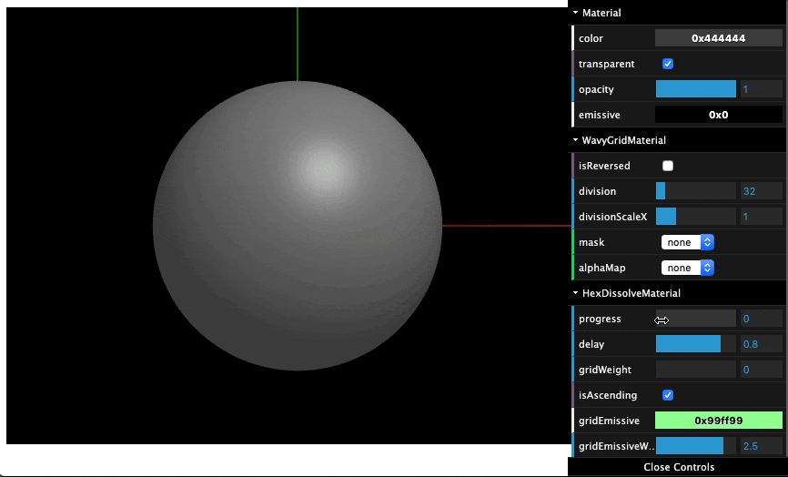

# threejs-shader-materials

> Collection of shader materials for three.js

[](https://github.com/MasatoMakino/threejs-shader-materials)

## Demo

[](https://masatomakino.github.io/threejs-shader-materials/demo/)

[Demo page](https://masatomakino.github.io/threejs-shader-materials/demo/)

## Getting Started

### Install

```bash
npm install MasatoMakino/threejs-shader-materials --save-dev
```

### Import

threejs-shader-materials is composed of ES6 modules and TypeScript d.ts files.

At first, import classes,

```js
import { HexGridMaterial } from "threejs-shader-materials";
```

and set material.

```js
const geo = new SphereGeometry(10, 64, 64);
const mat = new HexGridMaterial();
const mesh = new Mesh(geo, mat);
scene.add(mesh);
```

## API documents

[API documents](https://masatomakino.github.io/threejs-shader-materials/api/)

## License

[MIT licensed](LICENSE).
